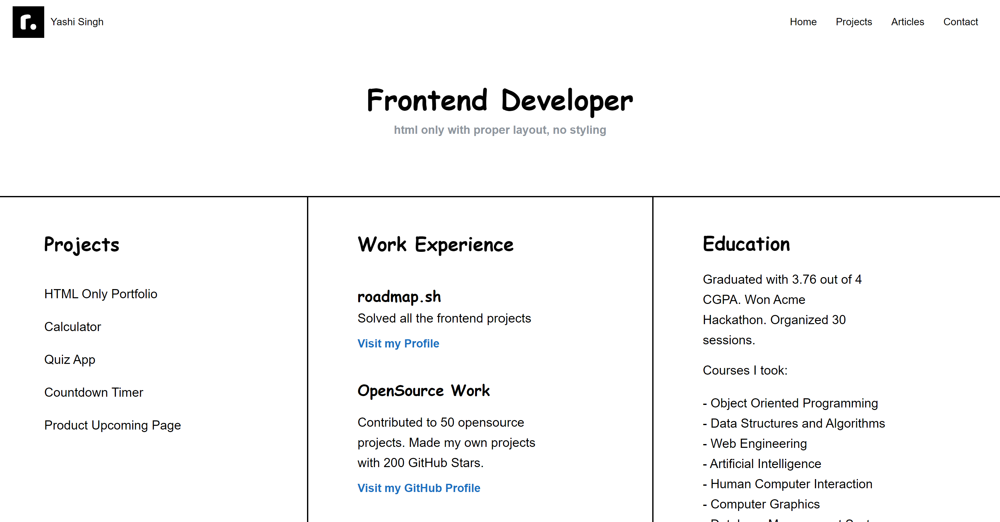

# Basic HTML Website

This project is part of the [roadmap.sh](https://roadmap.sh/projects/basic-html-website) frontend developer roadmap. The goal of the project is to teach you how to structure a basic website using only HTML. The site is a portfolio layout with proper sections like header, footer, navigation, and main content, but without styling beyond essential layout.

## Features
- Structured using semantic HTML elements.
- Includes sections like header, footer, navigation, and main content.
- Displays portfolio information such as projects, work experience, and reviews.
- Organized into multiple columns for different content types (projects, work experience, education, etc.).

## Visuals

Below is a basic layout of the HTML website:

## Installation
To use this project:
1. Clone the repository:  
   `git clone https://github.com/Yashi-Singh-9/Basic-HTML-Website.git`
2. Open `index.html` in your browser to view the website.

## Usage
This website serves as a basic portfolio layout template using only HTML. You can:
- Modify content in the `index.html` file to customize it for your own portfolio.
- Use the provided structure as a base for adding styles and additional functionality.

## Support
If you run into issues or have questions, you can:
- Reach out via [LinkedIn](https://www.linkedin.com/in/yashi-singh-b4143a246).

## Roadmap
Planned improvements for this project:
- Add CSS for better visual styling.
- Implement responsive design for mobile and tablet views.
- Add interactivity using JavaScript for sections like a calculator or quiz app.
  
## Contributing
Contributions are welcome! If you'd like to contribute:
1. Fork the repository.
2. Create a new branch:  
   `git checkout -b feature/new-feature`
3. Commit your changes:  
   `git commit -m 'Add new feature'`
4. Push to the branch:  
   `git push origin feature/new-feature`
5. Open a pull request.

## Authors and Acknowledgment
- **Yashi Singh** - Developer.
- **Roadmap.sh** - Project Creator.

## License
This project is licensed under the MIT License - see the [LICENSE](LICENSE) file for details.

## Project Status
This project is currently in its basic HTML phase, with further development planned to include CSS and JavaScript in future updates.
